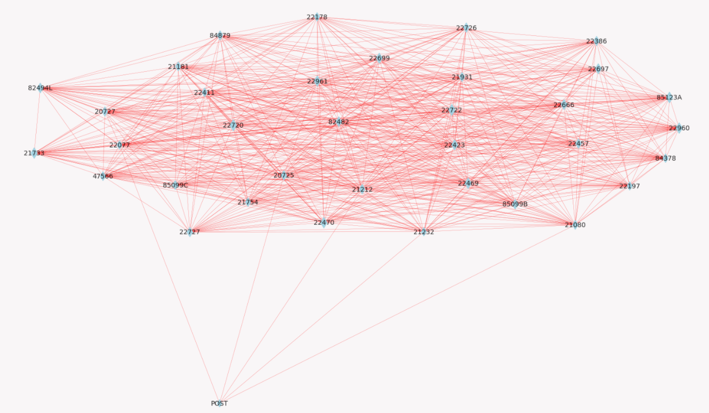
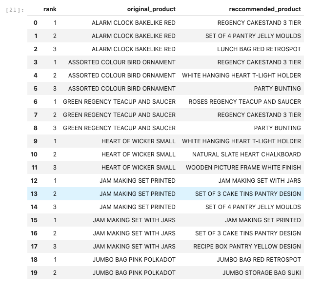

# Build The Model

## Introduction

In this lab, you will build a Apriori model to and analyze the association of different products in the data set. You will explore the statistical trends of the data, prep the data for model training, and analyze the results. There is a more detailed description within the notebook of what each cell does, but we will still provide a high level overview here.

Estimated time: 45 minutes

### Objectives

In this lab you will:
* Learn how to prepare data for the Apriori Algorithm.
* Learn commonly used data exploration techniques.
* Learn how build the market basket analysis model and analyze results.

### Prerequisites

* An Oracle Free Tier, Always Free, Paid or LiveLabs Cloud Account (see prerequisites in workshop menu)
* OCI Data Science service with dependencies (see previous lab)

## Task 1: Data Exploration and Data Preparation

In this lab we will walk through the data exploration phase of the notebook. Before you begin, make sure to run the cell that contains all import statements to set up the necessary environment.

If you did not complete the optional ADW portion of the lab, make sure to first run the cell under the heading 'Local File Storage'. If you did complete the ADW Lab, begin under the heading "Data Exploration and Data Preparation".

1. Plot the top 5 products

   Next, you will set up a bar graph that shows the top 10 most column products by percente occurence. You can see here that there is no product appears very frequently
   (as the most common product only appears in 0.5% of the occurence). 

   

   As it turns out, lots of products in this dataset appear too few times to draw any meaningful statistical conclusions. So in the next cell, you will trim the data frame so that only products that appear more than 0.2% of the time remains in the dataset. As you can see, the reduced the number of rows in the dataframe down to 1,742.

2. Feature Engineering

    Here you will create a new dataframe where each row is a unique customer id, each column is a unique product, and each value is the quantity the customer purchased of the product. This new data frame will allows you to focus on the columns of the initial data frame that actual provide relevant information for this specific use case.

    


## Task 2: Apply the Apriori Algorithm

1. Applying thresholds

   The first few cells under "Apply Apriori algorithm" applies thresholds on support on lift. Afterwhich. you will wrangle the data so that you can see support, confidence, lift and other metrics for each product.

   As the notebook describes,

   Measure 1: Support. This says how popular an itemset is, as measured by the proportion of transactions in which an itemset appears. If an item is purchased in 4 out of 8     
      transactions, then the support is 50%.
   Measure 2: Confidence. This says how likely item Y is purchased when item X is purchased, expressed as {X -> Y}. This is measured by the proportion of transactions with item
      X, in which item Y also appears. If beers are purchased 3 times out of 4 transctions where apples are purchased, then the confidence is 3 out of 4, or 75%.
   Measure 3: Lift. This says how likely item Y is purchased when item X is purchased, while controlling for how popular item Y is. A lift value of 1,which implies no
      association between items. A lift value greater than 1 means that item Y is likely to be bought if item X is bought, while a value less than 1 means that item Y is unlikely to be bought if item X is bought.

2. Visualize the data

   Next you will visualize the data using Networkx to be able to see the relationships between each of the products. As you can see, a large number of association rules have been discovered. Visualizing saves you time from having to manually scroll through all the association rules. The association rules should resemble the picture below.

    

## Task 3: Collaborative Filtering

1. Reformat data

   First, you will restructure the data frame to a table of products that was purchased by each customer. After inputting values for null quantities, you will drop any customers who did not purchase any products. 

   

2. Confusion Matrix

   Next you will form a confusion matrix for all the products we have. The way a confusion matrix works is it lists all the products on both the x and y axis, and
   provides a value at each (x,y) cordinate specifying the correlation between x and y. The stronger the association between the problems, the closer the value is to 1. The weaker the association is, the closer the value is to 0. Negative signs represent an inverse relationship.

   Notice that the confusion matrix is symmetrical around the diagnol. That is because all products are listed on both axis, and the order of the products ((x,y) vs (y,x)) does not matter. You'll also notice that the diagnol is 1. That is because at the diagnol, the products on both axis are the same.

   

3. Reccomend products

   Next you'll create a table that lists the most reccomended products based on cosine similarity.

   

   If you're intersted in the mathematical derivation of cosine similarity, you can read more about it 

## Task 4: Deploy model to model catalog

1. Create working model

    The following requires that you have successfully completed steps 1 to 4.

2. Store the model in the model catalog

    If we want applications/business processes to make good use of our model, then we need to deploy it first. We start by publishing the model to the model catalog. The following will **serialize** the model along with some other artifacts and store it in the catalog under the name "online-retail-model".

    ```python
    <copy>
    import ads
    from ads.common.model_artifact import ModelArtifact
    from ads.common.model_export_util import prepare_generic_model
    import os
    from os import path
    from joblib import dump
    import cloudpickle
    ads.set_auth(auth='resource_principal')
    path_to_model_artifacts = "online-retail"
    generic_model_artifact = prepare_generic_model(
        path_to_model_artifacts,
        force_overwrite=True,
        function_artifacts=False,
        data_science_env=True)
    with open(path.join(path_to_model_artifacts, "model.pkl"), "wb") as outfile: cloudpickle.dump(model, outfile)
    catalog_entry = generic_model_artifact.save(display_name='online-retail-model',
        description='Model to reccommend online retail products')
    </copy>
    ```

3. Deploy the model

    Now we're going to deploy this model to its own compute instance. This will take the model from the catalog and create a runtime version of it that's ready to receive requests. This uses normal OCI compute shapes. Next, choose "Create Deployment".

    
    

    - Give the model deployment a name, e.g. "online retail model deployment"
    - Choose the right model (online-retail-model)
    - Choose a shape, one instance of VM.Standard2.1 is sufficient. Note that we could have chosen multiple instances, this is useful for models that are used very intensively.

    Finally, submit the deployment. This should take about 10 minutes. Finally, you should see that the compute instance is active.

    
Congratulations on completing this lab!

You may now proceed to the next lab.

## Acknowledgements
* **Authors** - Jeroen Kloosterman - Product Strategy Manager - Oracle Digital, Lyudmil Pelov - Senior Principal Product Manager - A-Team Cloud Solution Architects, Fredrick Bergstrand - Sales Engineer Analytics - Oracle Digital, Hans Viehmann - Group Manager - Spatial and Graph Product Management, Simon Weisser - Cloud Engineer
* **Last Updated By/Date** - Simon Weisser, Cloud Engineer, Dec 2021

