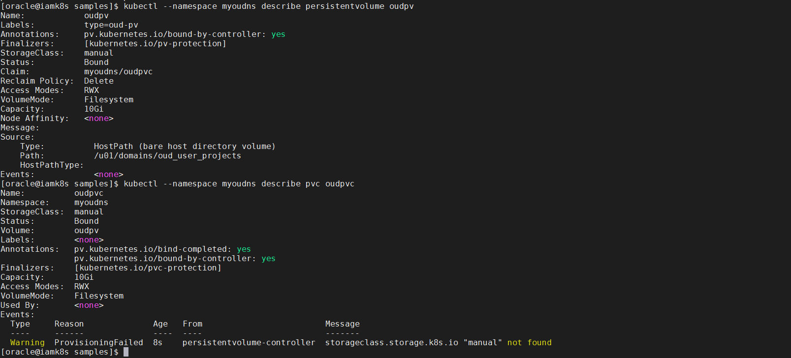

# Deploy Oracle Unified Directory(OUD)

## Introduction

This lab provides information about steps involved in deploying and running Oracle Unified Directory 12c PS4 (12.2.1.4.0) in a Kubernetes environment.

*Estimated Time:* 20 minutes

### About <Product/Technology>

Oracle Unified Directory provides a comprehensive Directory Solution for robust Identity Management. Oracle Unified Directory is an all-in-one directory solution with storage, proxy, synchronization and virtualization capabilities. While unifying the approach, it provides all the services required for high-performance Enterprise and carrier-grade environments. Oracle Unified Directory ensures scalability to billions of entries, ease of installation, elastic deployments, enterprise manageability and effective monitoring.

### Objectives

In this lab, you will:
* Create an OUD instance in the kubernetes environment

### Prerequisites
This lab assumes you have:
- A Free Tier, Paid or LiveLabs Oracle Cloud account
- You have completed:
    - Lab: Prepare Setup (*Free-tier* and *Paid Tenants* only)
    - Lab: Environment Setup
    - Lab: Initialize the Environment
		- Lab: Deploy Oracle Identity Governance(OIG) domain
		- Lab: Deploy Oracle Access Manager(OAM) domain

## Task 1: Prepare the environment for Container Creation

1. Check the Kubernetes Cluster is Ready

	```
	<copy>kubectl get nodes,pods -n kube-system</copy>
	```

	

2. Check the Oracle Unified Directory Image

	```
	<copy>docker images | grep oud</copy>
	```

3. Create Kubernetes Namespace

	```
	<copy>cd /u01/k8siam/fmw-kubernetes/OracleUnifiedDirectory/kubernetes/samples/</copy>
	```

	```
	<copy>cp oudns.yaml oudns.yaml_orig</copy>
	```

	```
	<copy>cp /u01/sampleFilesOUD/oudns.yaml .</copy>
	```

	```
	<copy>kubectl apply -f oudns.yaml</copy>
	```

4. Confirm that the namespace is created:

	```
	<copy>kubectl get namespaces </copy>
	```

5. Create Secrets for User IDs and Passwords

	```
	<copy>cp secrets.yaml secrets.yaml_orig</copy>
	```

	```
	<copy>cp /u01/sampleFilesOUD/secrets.yaml .</copy>
	```

	This file includes updated secret, namespace and other parameters with specified values in Base64 format

	secret - oudsecret

	namespace - myoudns

	%rootUserDN% - Base64 encoded value of 'cn=Directory Manager' for rootUserDN parameter

	%rootUserPassword% - Base64 encoded value of 'Welcom@123' rootUserPassword parameter

	%adminUID% - Base64 encoded value of 'admin' for adminUID parameter

	%adminPassword% - Base64 encoded value of 'Welcom@123' for adminPassword parameter

	%bindDN1% - Base64 encoded value of 'cn=Directory Manager bindDN1 parameter

	%bindPassword1% - Base64 encoded value of 'Welcom@123 for bindPassword1 parameter

	%bindDN2% - Base64 encoded value of 'cn=Directory Manager for bindDN2 parameter

	%bindPassword2% - Base64 encoded value of 'Welcom@123' for bindPassword2 parameter

6. Apply the file:

	```
	<copy>kubectl apply -f secrets.yaml</copy>
	```

7. Verify that the secret has been created:

	```
	<copy>kubectl --namespace myoudns get secret</copy>
	```

8. Prepare a Host Directory to be used for Filesystem Based PersistentVolume

	```
	<copy>mkdir -p /u01/domains/oud_user_projects</copy>
	```

	```
	<copy>chmod 777 /u01/domains/oud_user_projects</copy>
	```

	```
	<copy>cp persistent-volume.yaml persistent-volume.yaml_orig</copy>
	```

	```
	<copy>cp /u01/sampleFilesOUD/persistent-volume.yaml .</copy>
	```

9. Apply the file:

	```
	<copy>kubectl apply -f persistent-volume.yaml</copy>
	```

10. Verify the PersistentVolume and PersistentVolumeClaim

	```
	<copy>kubectl --namespace myoudns describe persistentvolume oudpv</copy>
	```

	```
	<copy>kubectl --namespace myoudns describe pvc oudpvc</copy>
	```

	


## Task 2: Directory Server (instanceType=Directory)

As part of this lab, we'll create a POD (oudpod1) which comprises of a single container based on an Oracle Unified Directory 12c PS4 (12.2.1.4.0) image.

1. To create the POD, make a copy of the oud-dir-pod.yaml file updated with the appropriate values.

	```
	<copy>cd /u01/k8siam/fmw-kubernetes/OracleUnifiedDirectory/kubernetes/samples/</copy>
	```

	```
	<copy>cp /u01/sampleFilesOUD/oud-dir-pod.yaml .</copy>
	```

	This sample file includes the below updated parameters:

	Namespace - myoudns

	Oracle image tag - oracle/oud:12.2.1.4.0

	Secret name - oudsecret

	PV name - oudpv

	PVC name - oudpvc

	No. of sample entries - 15

2. Apply the file.

	```
	<copy>kubectl apply -f oud-dir-pod.yaml</copy>
	```

3. Check the status of the created pod:

	```
	<copy>kubectl get pods -n myoudns</copy>
	```

	


	To tail the container logs while it is initialising use the following command:

	```
	<copy>kubectl --namespace myoudns logs -f -c oudds1 oudpod1</copy>
	```

	Press Ctrl+C to exit the container logs

4. To validate that the Oracle Unified Directory directory server instance is running, connect to the container:

	```
	<copy>kubectl --namespace myoudns exec -it -c oudds1 oudpod1 /bin/bash</copy>
	```

5. In the container, run ldapsearch to return entries from the directory server:

	```
	<copy>cd /u01/oracle/user_projects/oudpod1/OUD/bin</copy>
	```

	```
	<copy>./ldapsearch -h localhost -p 1389 -D "cn=Directory Manager" -w Welcom@123 -b "" -s sub "(objectclass=*)" dn</copy>
	```

	


	```
	<copy>exit</copy>
	```

## Learn More

* [Reference for Oracle Unified Directory on Docker and Kubernetes](https://docs.oracle.com/en/middleware/idm/access-manager/12.2.1.4/oamkd/overview.html#GUID-38F207C8-E648-4A79-8205-942DAD5F674A)

## Acknowledgements
* **Author** - Keerti R, Anuj Tripathi, NATD Solution Engineering
* **Contributors** -  Keerti R, Anuj Tripathi
* **Last Updated By/Date** - Keerti R, NATD Solution Engineering, January 2022
